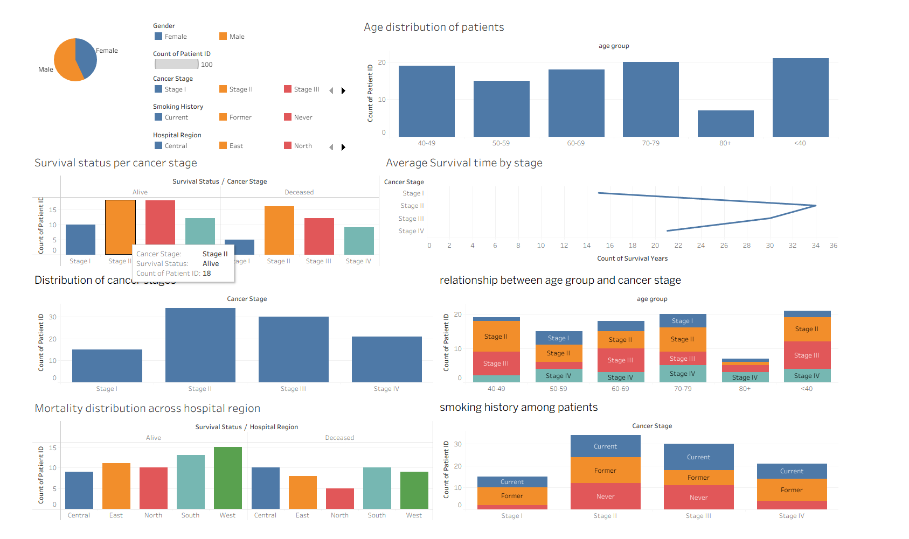
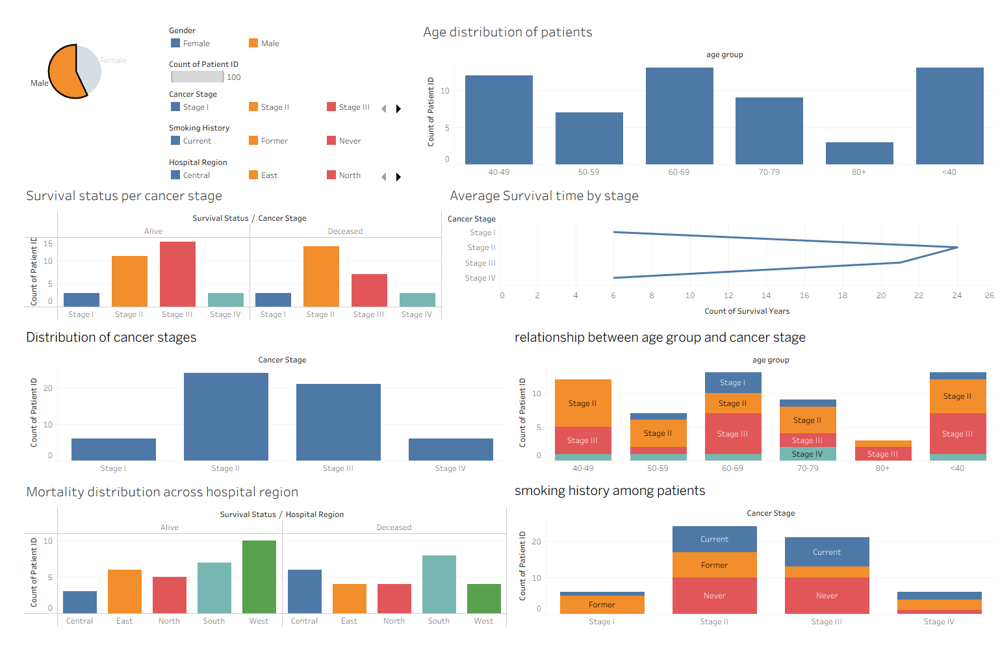
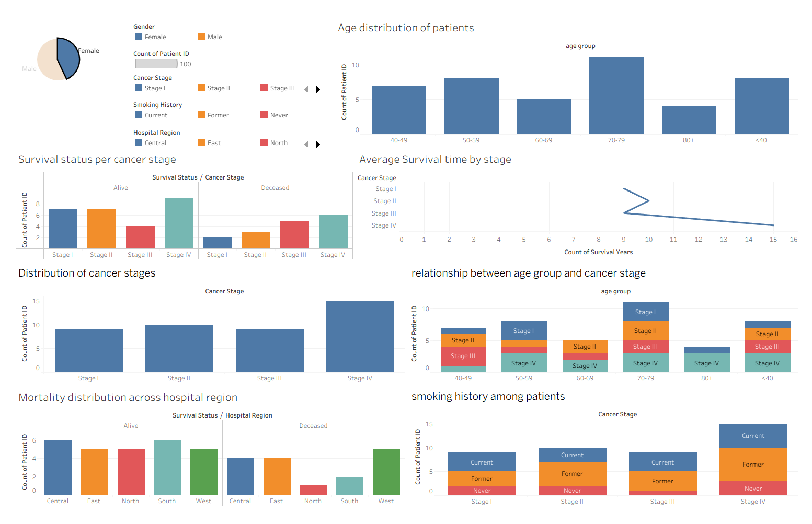
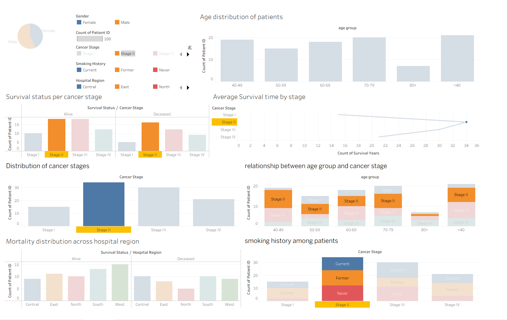

# 🫁 Lung Cancer Data Analytics Project

## 📊 Overview

This project focuses on the analysis and visualization of lung cancer patient data to uncover insights that can aid in early diagnosis, treatment planning, and awareness. Using real-world inspired datasets, we explore key trends in age distribution, cancer stages, gender patterns, and more, visualized using **Tableau** dashboards.

---

## 🗂️ Dataset Description

The dataset used in this project contains patient information with the following columns:

| Column Name       | Description                                         |
|-------------------|-----------------------------------------------------|
| `id`              | Unique identifier for each patient                  |
| `age`             | Age of the patient                                  |
| `gender`          | Gender of the patient (Male/Female)                 |
| `smoking_status`  | Smoking habit status (Smoker/Non-Smoker/Unknown)   |
| `cancer_stage`    | Stage of cancer (Stage I, II, III, IV)             |
| `diagnosis_date`  | Date of cancer diagnosis                            |
| `region`          | Geographic region of the patient                    |
| `treatment_type`  | Type of treatment received (Chemotherapy, etc.)     |
| `survival_status` | Survival outcome (Alive/Deceased)                  |

---

## 🎯 Project Goals

- Analyze patient demographics (age, gender, smoking status)
- Identify distribution across cancer stages
- Understand treatment patterns
- Evaluate survival trends
- Build interactive Tableau dashboards for stakeholders

---

## 📈 Key Analyses & Visuals

✅ Age Distribution vs Cancer Stages  
✅ Gender-wise Stage Comparison  
✅ Regional Spread of Lung Cancer  
✅ Smoking vs Non-Smoking Impact  
✅ Treatment Effectiveness  
✅ Survival Status Trends  

> All visuals are built using **Tableau** for interactive exploration and storytelling.

## 🛠️ Tools & Technologies

- **Tableau Public** – For data visualization and dashboarding
- **Microsoft Excel / Google Sheets** – For initial data cleaning
- **Python** – For preprocessing or extra analysis
- **Markdown** – For documenting this project

---

Here are some dashboard views from the project:

**1.**

**2.**

**3.**

**4.**

---

## 🧾 Conclusion

The lung cancer data analytics project reveals several critical insights:

1. **Age Distribution**:  
   Patients under 40 and between 70–79 years represent a significant portion of lung cancer cases, highlighting the need for age-specific awareness and early screening strategies.

2. **Cancer Stage Trends**:  
   Stage II and Stage III cancers are the most prevalent, suggesting diagnoses often occur after the early stage window. This reinforces the urgency for improved early detection programs.

3. **Survival Insights**:  
   Patients diagnosed at **Stage I** and **Stage II** show better survival outcomes, confirming the importance of early intervention. Survival years drop sharply for later stages.

4. **Smoking History**:  
   There is a strong correlation between **current or former smokers** and advanced cancer stages. Non-smokers are more commonly found in Stage I, supporting public health campaigns focused on tobacco cessation.

5. **Gender & Region Patterns**:  
   Males are slightly more affected than females, and regional differences in mortality rates (e.g., higher in the **West**) suggest potential gaps in regional healthcare infrastructure or access.

6. **Hospital Mortality Distribution**:  
   Variation in mortality by region and hospital indicates potential for optimizing treatment protocols and resource allocation in underperforming areas.

7. **Age & Stage Correlation**:  
   The 60–69 and <40 age groups show wide stage distribution, making them key targets for education and early testing.

---

### 📌 Final Thoughts

These findings can inform:
- 🎯 **Policy makers** to allocate resources better.
- 🏥 **Hospitals** to enhance treatment efficiency.
- 📢 **Awareness campaigns** focusing on smoking and early diagnosis.
- 🧠 **Further research** using larger or real-world clinical datasets.

By leveraging interactive dashboards and data storytelling, this project transforms raw clinical data into actionable insights that can save lives.

## 👨‍⚕️ Use Cases

- For oncologists to understand patient demographics
- For public health policymakers to identify high-risk regions
- For hospitals to improve treatment strategies
- For awareness campaigns based on smoking and stage trends

---

## 📬 Contact

For queries, suggestions, or collaborations:  
**Vikas**  
Email: `vikas260804@gmail.com`  

---

> © 2025 Lung Cancer Analytics by [Vikas]. For educational and research purposes only.
